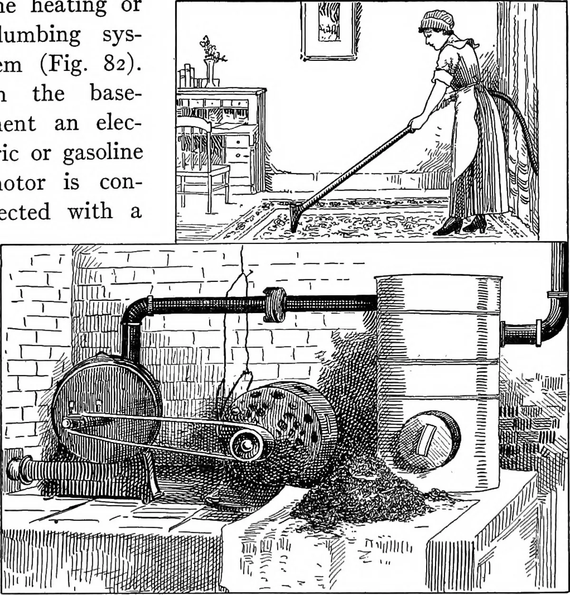

# Usage Vacuum 

Usage Vacuum takes a Python script built to demo some functionality with print output, converts it to markdown.
The markdown contains the demo code interspersed with print output.

This works well with my process:
* As I develop functionality, I write tests, but I also write a demo usage script.
* The demo usage script looks like a walk through of what my new code does.
* So converting it into interesting markdown makes sense to me.

Essentially: input is a demo python script for functionality
output is markdown showing how the code produces output, created from the code itself.

Saves time if you are producing walkthrough markdown and have a script.

Another benefit is that you can test your demo usage script, then convert it to markdown when it works.
This prevents beautiful markdown with scripting in it which does not work or does not produce the advertised output.

---

## Future Plans

- **Enhanced Output Formatting:** More options for customizing the Markdown output.
- **Jupyter Notebook Support:** Convert demo scripts directly into Jupyter Notebooks.
- **CLI Improvements:** Add more command-line options and interactive prompts.
- **Automated Testing:** Integrate with CI for automated validation of scripts and output.
- **Plugin/Extension System:** Allow for user-contributed extensions to support other formats or workflows.

---

## Important Disclaimer

This tool is intended to assist with documentation generation for Python scripts. It is provided as-is and may not handle every possible edge case in Python output or formatting.

---

## Getting Started

To get started with Usage Vacuum, prepare a Python script that demonstrates the functionality you want to showcase. This script should include print statements to display outputs as you walk through the code.

---

## Prerequisites

- Python 3.7 or newer
- `pip` (Python package manager)
- (Recommended) A virtual environment (`venv` or `virtualenv`)
- A standalone Python demo script that runs without errors

---

## Installing

1. Clone this repository:
    ```sh
    git clone https://github.com/ErikPohl444/usage_vacuum.git
    cd usage_vacuum
    ```
2. (Recommended) Create and activate a virtual environment:
    ```sh
    python -m venv venv
    source venv/bin/activate  # On Windows: venv\Scripts\activate
    ```
3. Install dependencies:
    ```sh
    pip install -r requirements.txt
    ```
    If `requirements.txt` is missing, install needed libraries as you encounter ImportErrors, or generate one with:
    ```sh
    pip freeze > requirements.txt
    ```

---

## Running the Tests

Tests are pending.  Watch this space.

---

## Technologies Used

- Python 3.7+
- Standard Python libraries

---

## Minimum System Requirements

- Python 3.7 or newer
- Works on Linux, macOS, and Windows

---

## Contributing

Contributions are welcome! See the [Contribution Guidelines](CONTRIBUTING.md) for details.

1. Fork this repository.
2. Create a new branch for your feature or bugfix.
3. Make your changes.
4. Test your code.
5. Submit a pull request.

---

## Authors

See the [Authors doc.](AUTHORS.md).

---

## License

This project is licensed under the MIT License. See the [LICENSE](LICENSE) file for details.

---

## Acknowledgments

- Thanks to everyone who has motivated me to learn more.
- Special thanks to the contributors listed in [ACKNOWLEDGEMENTS](ACKNOWLEDGEMENTS.md).
